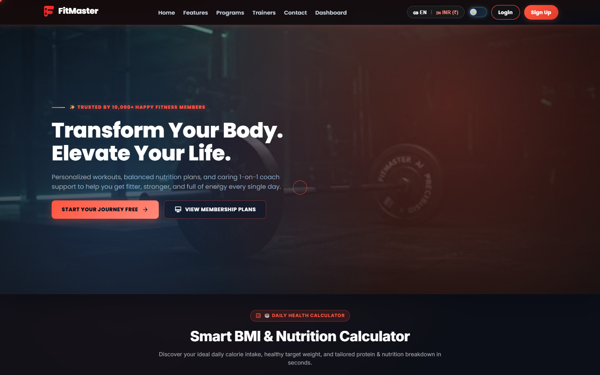
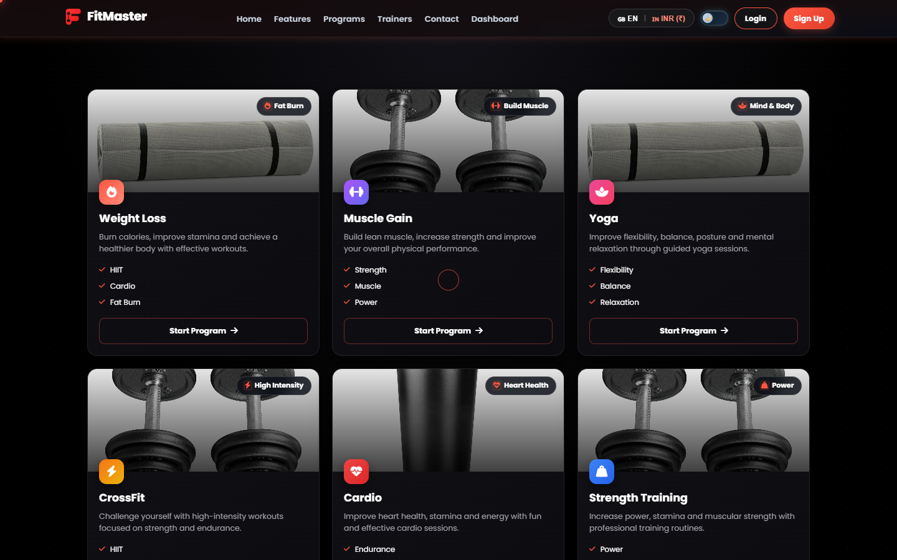
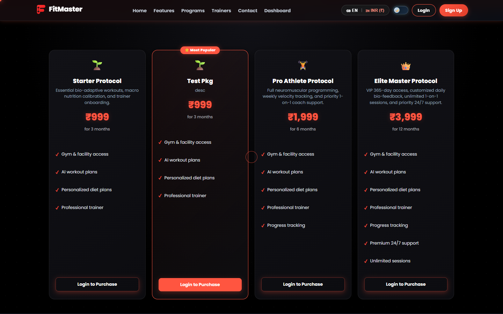
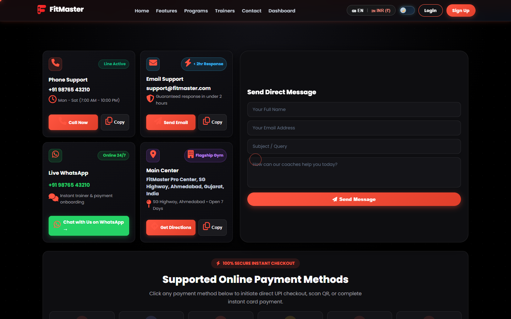
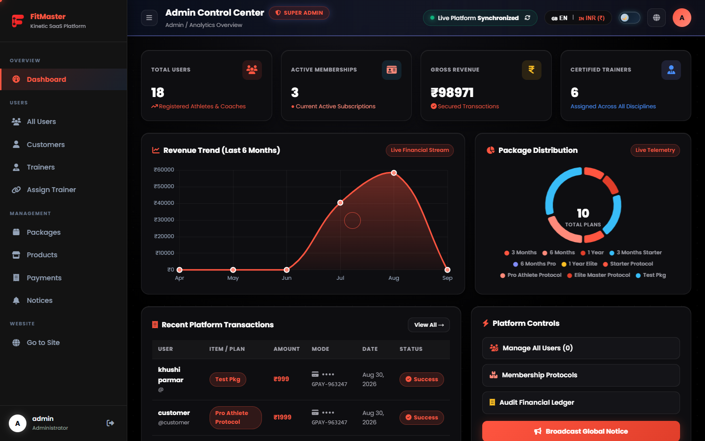
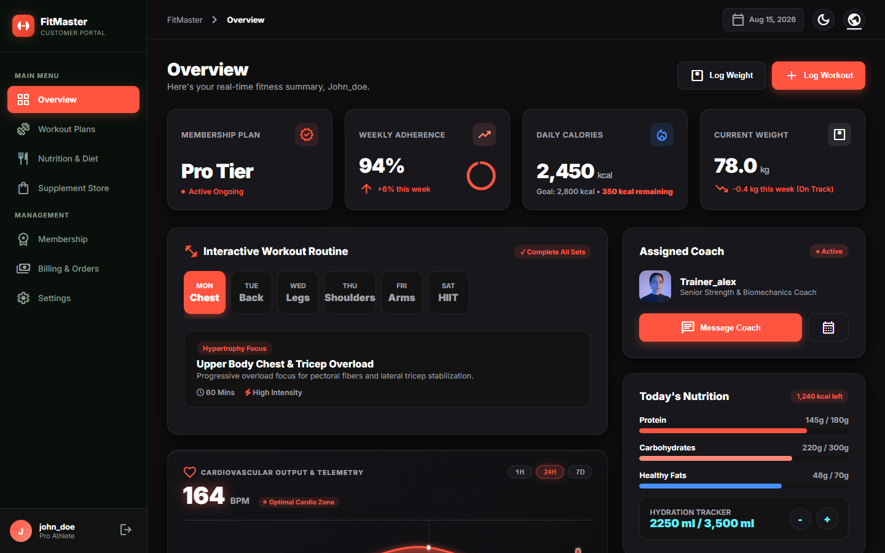

# ⚡ FitMaster AI — Next-Gen Fitness & Gym Management Platform

<p align="center">
  
</p>

<p align="center">
  <b>An AI-powered, 3D interactive fitness ecosystem designed for athletes, personal trainers, and gym administrators.</b>
</p>

<p align="center">
  
  
  
  
  
</p>

---

## 📸 Visual Previews & Screenshots

### 1. 🌐 Landing Page & 3D Interactive Hero
*Ultra-modern dark theme with Three.js particle dynamics, responsive navigation, and dynamic counters.*


---

### 2. 🏋️‍♂️ Dynamic Workout & Training Programs
*Comprehensive catalog of Strength, Cardio, CrossFit, and Yoga programs with animated interactions.*


---

### 3. 💳 Membership Tiers & Razorpay / UPI Gateway
*Flexible starter, pro, and elite memberships integrated with Razorpay Checkout, BHIM UPI QR scan, and instant invoice generation.*


---

### 4. 📞 Live 24/7 Support & Contact Center
*Interactive contact system featuring instant WhatsApp chat (`wa.me`), one-click call (`tel:`), email support, and Google Maps GPS navigation.*


---

### 5. 📊 Admin Command Center (Live Platform Synchronization)
*Executive analytics dashboard featuring real-time financial tracking, member management, package control, and live sync engine.*


---

### 6. 🏃 Athlete & Member Dashboard
*Personalized progress metrics, assigned personal trainer routines, BMI tracking, nutrition plans, and workout logs.*


---

## ✨ Key Features

- **Role-Based Access Control (RBAC):** Dedicated views and interfaces for **Admin**, **Trainers**, and **Members / Athletes**.
- **Interactive 3D Visualizer:** Built-in Three.js hero and biomechanics model for workout engagement.
- **Payment & Invoicing Gateway:** Complete Razorpay Express modal + simulated UPI QR scan and PDF/HTML billing invoice generator.
- **Live Support Hub:** Direct WhatsApp customer routing, direct telephone calling, and real-time center geolocation.
- **Trainer Client Allocation:** Assign specialized trainers (Gym, Yoga, Zumba) to individual clients with custom diet and workout regimes.
- **Micro-Animations & Responsive Design:** Vanilla CSS glassmorphism, fluid typography, dark/light theme toggle, and 60fps animations.

---

## 🚀 Quick Start Guide

### 1. Clone the Repository
```bash
git clone https://github.com/parmarkhushi2026-max/FitMaster-AI.git
cd FitMaster-AI
```

### 2. Create and Activate Virtual Environment
```bash
# Windows
python -m venv venv
.\venv\Scripts\activate

# macOS / Linux
python3 -m venv venv
source venv/bin/activate
```

### 3. Install Dependencies
```bash
pip install -r requirements.txt
```

### 4. Configure Environment Variables
```bash
# Copy template
cp .env.example .env
```

### 5. Run Database Migrations & Seed Demo Data
```bash
python manage.py migrate
python manage.py seed_data
```

### 6. Start Development Server
```bash
python manage.py runserver
```
Visit **`http://127.0.0.1:8000/`** in your browser!

---

## 🔐 Default Demo Accounts

| Role | Username | Password | Access Level |
| :--- | :--- | :--- | :--- |
| **Administrator** | `admin` | `admin123` | Full control, finance KPI, user & package management |
| **Personal Trainer** | `trainer_alex` | `trainer123` | Assigned client rosters, diet/workout planning |
| **Athlete / Member** | `john_doe` | `customer123` | Workout logs, memberships, store & invoices |

---

## 🛠️ Tech Stack

- **Backend:** Python 3.12+, Django 5.1+, SQLite / PostgreSQL
- **Frontend:** Semantic HTML5, Vanilla Modern CSS, JavaScript (ES6+), Three.js
- **Payment:** Razorpay JavaScript Checkout SDK + UPI Integration
- **Deployment:** Docker, Docker Compose, WhiteNoise, Gunicorn / Waitress

---

## 📄 License
This project is open-source and available under the [MIT License](LICENSE).
