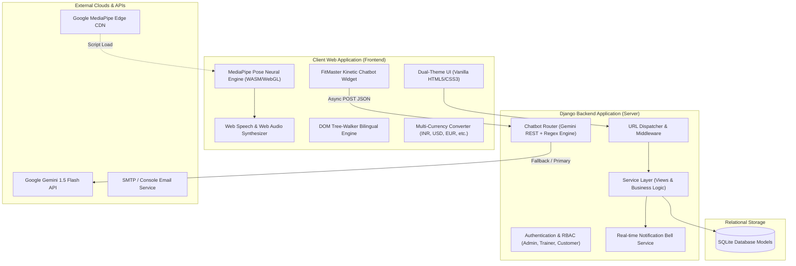
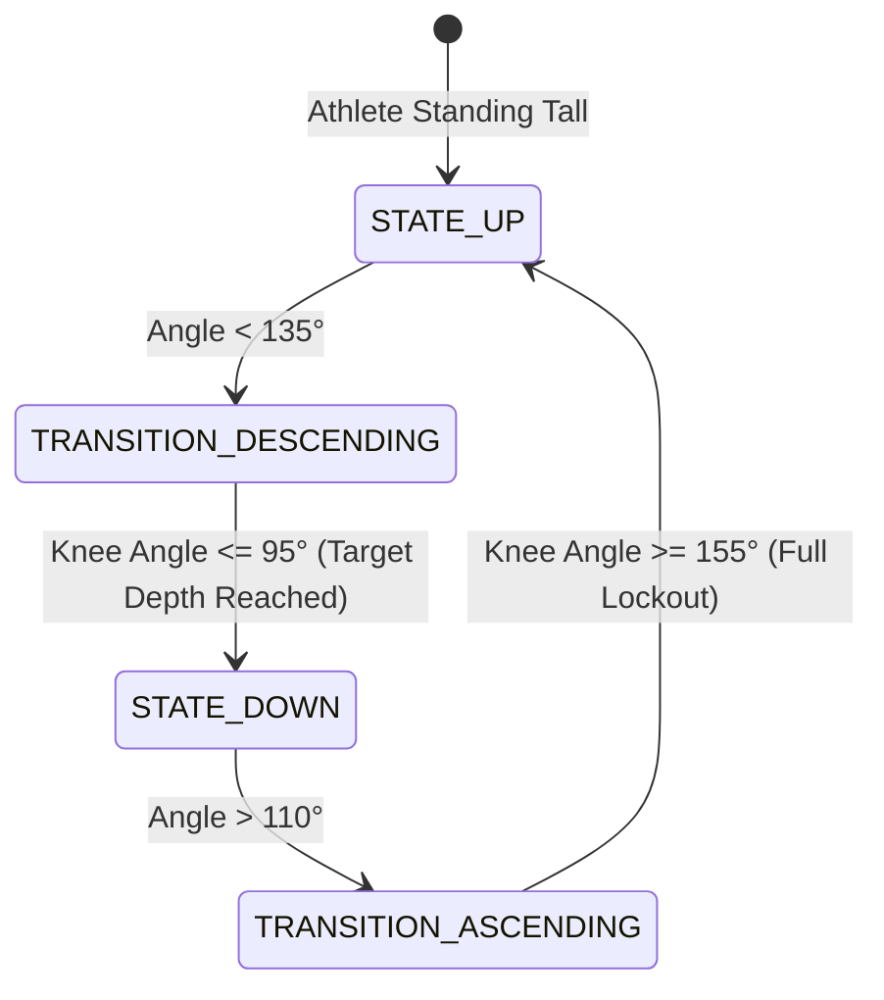
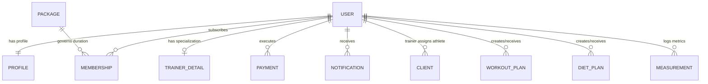
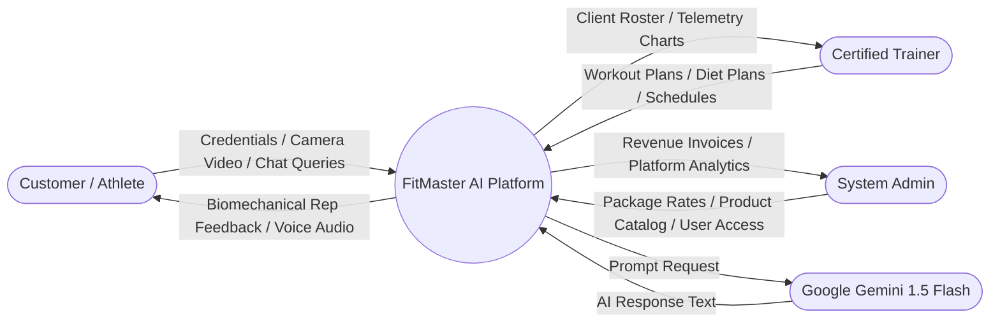

# FitMaster AI — Complete Technical Architecture & System Documentation

## 1. Project Overview & Motivation
**FitMaster AI** is an enterprise-grade kinetic fitness coaching and telemetry platform built with **Python 3.12, Django 6.0, Google MediaPipe Pose, Web Speech API, and Google Gemini 1.5 Flash**.

The primary motivation is democratizing high-performance athletic coaching: providing athletes with real-time computer-vision skeletal tracking, repetition counting, and biomechanical posture guidance directly in the browser with zero hardware or wearable costs.

---

## 2. High-Level System Architecture

---

## 3. Live AI Vision & Biomechanical Pose Algorithms

### A. 3-Point Joint Vector Angle Formula
For any joint $B$ connected to adjacent joints $A$ and $C$:
$$\vec{u} = A - B = (A_x - B_x, A_y - B_y)$$
$$\vec{v} = C - B = (C_x - B_x, C_y - B_y)$$
$$\theta = \arccos\left(\frac{\vec{u} \cdot \vec{v}}{\|\vec{u}\| \|\vec{v}\|}\right) \times \left(\frac{180^\circ}{\pi}\right)$$

### B. Finite State Machine (Hysteresis Repetition Counter)

| Exercise | Tracked Landmarks | Down Threshold | Up Threshold | Calorie Burn Rate |
| :--- | :--- | :--- | :--- | :--- |
| **Squats** | Hip (23), Knee (25), Ankle (27) | $\le 95^\circ$ | $\ge 155^\circ$ | 0.32 kcal/rep |
| **Bicep Curls** | Shoulder (12), Elbow (14), Wrist (16) | $\le 45^\circ$ | $\ge 145^\circ$ | 0.22 kcal/rep |
| **Push-Ups** | Shoulder (12), Elbow (14), Wrist (16) | $\le 85^\circ$ | $\ge 150^\circ$ | 0.28 kcal/rep |
| **Jumping Jacks** | Hip (24), Shoulder (12), Wrist (16) | $\ge 140^\circ$ | $\le 50^\circ$ | 0.20 kcal/rep |

---

## 4. Entity Relationship (ER) Conceptual Schema

---

## 5. Data Flow Diagrams (DFD)

### DFD Level 0 (Context Diagram)

---

## 6. Mathematical Nutrition & Calorie Formulas

### A. Mifflin-St Jeor Formula (BMR)
- **Male**: $\text{BMR} = (10 \times \text{weight}_{\text{kg}}) + (6.25 \times \text{height}_{\text{cm}}) - (5 \times \text{age}) + 5$
- **Female**: $\text{BMR} = (10 \times \text{weight}_{\text{kg}}) + (6.25 \times \text{height}_{\text{cm}}) - (5 \times \text{age}) - 161$
- **Total Daily Energy Expenditure (TDEE)**: $\text{TDEE} = \text{BMR} \times \text{Activity Factor}$

---

## 7. Viva & Interview Questions Cheatsheet

1. **Why MediaPipe in the browser instead of server-side OpenCV?**
   * *Answer:* Running computer vision on the client side eliminates video streaming bandwidth, avoids expensive GPU servers, ensures zero network latency (60 FPS inference), and protects user camera privacy.
2. **How does the system prevent false repetition counts?**
   * *Answer:* It uses a dual-threshold hysteresis finite state machine (FSM). Repetitions are only credited after crossing both the contraction threshold and the extension lockout threshold.
3. **How does the safe bilingual translation engine preserve icons?**
   * *Answer:* Instead of setting `element.innerHTML` or `element.textContent`, it uses a recursive `document.createTreeWalker(root, NodeFilter.SHOW_TEXT)` to modify text nodes directly while caching `node._origVal`.
